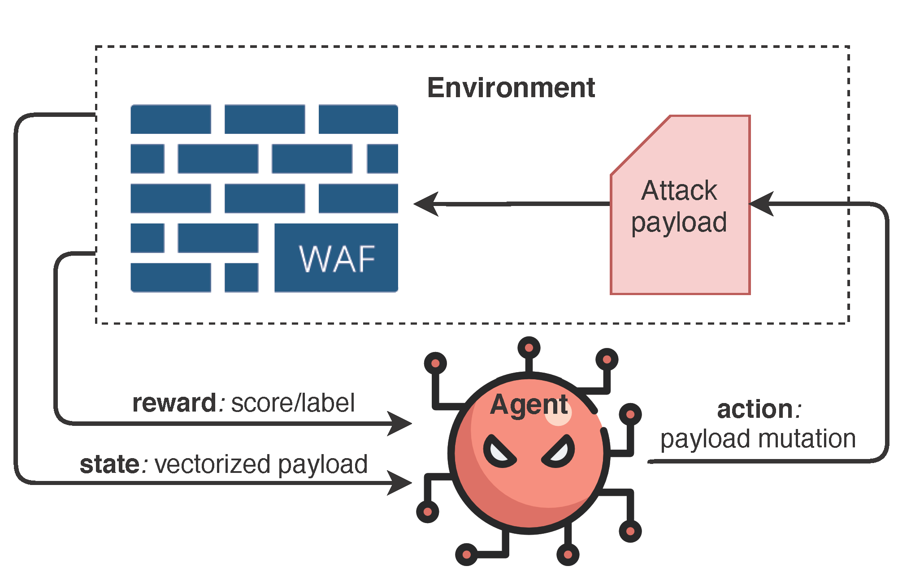

# WAF Evasion Environment for OpenAI Gym [Experimental] 
**************************

### Installation
`pip install gym-waf`

### Currently available environments
- `WafBrain-v0`: WafBrain (ML-based, scores available) evasion with 1k SQL payloads
- `WafLibinj-v0`: Libinjection (rule-based, only labels) evasion with 1k SQL payloads
- `WafBrain-single-v0`: WafBrain evasion with single payload
- `WafLibinj-single-v0`: Libinjection evasion with single payload

### Environment details:
- action space: `Discrete(9)`
- observation space: `Box(970,)`
- reward: ranging from 0.0 to 10.0 

### Based on several projects:
- [gym-malware](https://github.com/endgameinc/gym-malware)
- [WAF-A-MoLE](https://github.com/AvalZ/waf-a-mole)
- [WAF-Brain](https://github.com/BBVA/waf-brain)
- [sql-injection-dataset](https://www.kaggle.com/syedsaqlainhussain/sql-injection-dataset)

